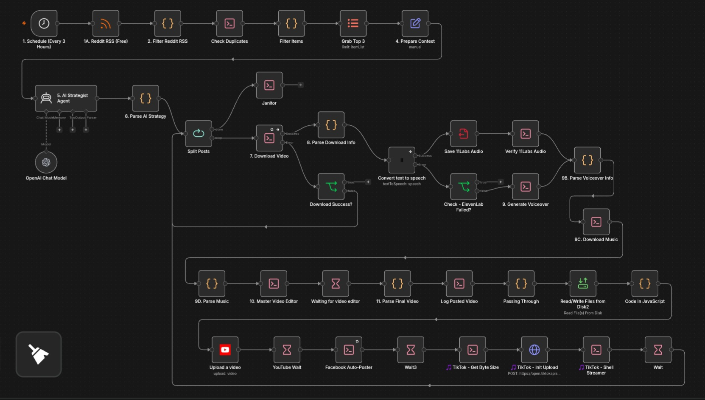
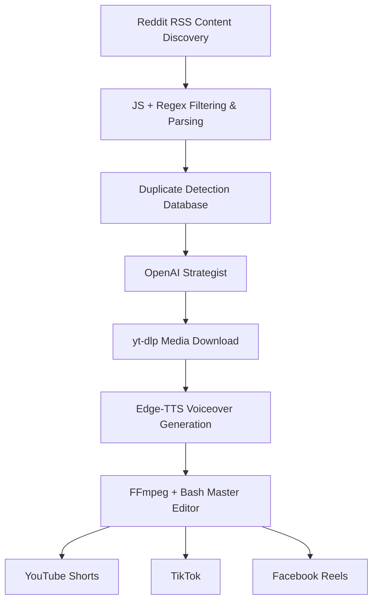

# ⚽ AI Football Media Engine

An end-to-end AI-powered football content automation pipeline built with n8n, AI, FFmpeg, yt-dlp, and social media APIs.

The system automates the journey from discovering football content to analyzing it with AI, generating commentary, processing vertical short-form videos, and preparing/publishing content across multiple social platforms.

> **Portfolio Project:** Built to demonstrate advanced n8n workflow engineering, AI integration, media processing, API integration, and automation architecture.

## 🚀 What It Does

The workflow connects several independent automation stages into one media-processing pipeline:

`Content Discovery` → `Filtering` → `Duplicate Detection` → `AI Analysis` → `Video Download` → `Voiceover` → `Video Processing` → `Multi-Platform Publishing`

The goal is to reduce the repetitive work involved in operating a football-focused short-form content workflow.

## 🧠 Architecture

### 1. 🔎 Content Discovery — The Scout

The workflow monitors football content through Reddit RSS feeds. Custom JavaScript and Regex filtering logic identifies relevant football moments such as:

* Goals, Assists, Red cards, Saves, Penalties
* Match score patterns (e.g., `[1] - 0`)

It also filters unwanted content (quotes, interviews) and validates supported video sources before allowing a post to continue through the pipeline.

### 2. 🔁 Duplicate Prevention

Before processing a video, the system checks its unique ID against a persistent local log of previously processed content. Previously processed videos are skipped automatically, preventing the same content from entering the publishing pipeline multiple times.

### 3. 🧠 AI Strategy — The Pundit

Relevant football content is passed to an OpenAI-powered AI strategy agent. The AI analyzes the available metadata and returns structured JSON containing:

* Content classification & recommended duration
* Short-form captions & long-form descriptions
* Voiceover scripts & YouTube SEO metadata
* Content suitability & editing instructions

**Quality Control:** A dedicated parsing and validation layer verifies the AI response before downstream processing begins. Invalid AI responses are safely rejected instead of breaking later stages of the workflow.

### 4. 📥 Automated Media Download

The workflow uses `yt-dlp` to retrieve supported source media automatically. Downloaded media is validated and prepared inside a temporary working directory before entering the editing pipeline.

### 5. 🎙️ AI Voiceover — The Commentator

The generated commentary script is automatically converted into speech using Edge-TTS. The workflow generates the voiceover, calculates its duration, and passes the resulting audio to the video-processing stage. No manual voice recording is required.

### 6. 🎬 Automated Video Processing — The Editor

A custom Bash and FFmpeg pipeline handles video production. The processing stage includes:

* Automated clipping & timestamp-based segment processing (Seamless punch-cuts)
* 9:16 vertical formatting, dynamic scaling, and cropping
* Caption rendering (Sanitized for FFmpeg compatibility)
* Visual enhancement & color grading
* Voiceover synchronization & audio normalization
* Temporary-file cleanup

### 7. 🚀 Multi-Platform Distribution — The Distributor

After processing, the workflow prepares the final video and generated metadata for social publishing integrations:

* YouTube Shorts (v3 API)
* TikTok (Native API)
* Facebook Reels (Meta Graph API)

## 🛠️ Tech Stack

| Technology     | Purpose                                               |
| -------------- | ----------------------------------------------------- |
| **n8n**        | Workflow orchestration                                |
| **OpenAI**     | AI content strategy, parsing, and script generation   |
| **JavaScript** | Filtering, data parsing, and fallback logic           |
| **Bash**       | Server-side media automation and file management      |
| **FFmpeg**     | Video/audio processing and visual transformations     |
| **yt-dlp**     | Media retrieval                                       |
| **Edge-TTS**   | Automated voice generation                            |
| **Reddit RSS** | Content discovery                                     |
| **REST APIs**  | Multi-platform publishing (YouTube, TikTok, Facebook) |

## 🔄 Pipeline

