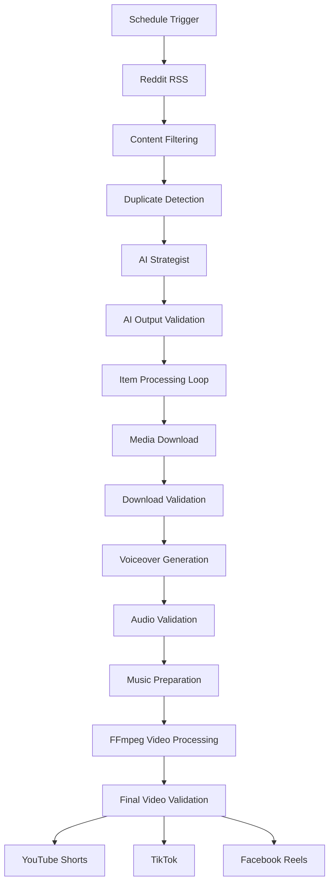
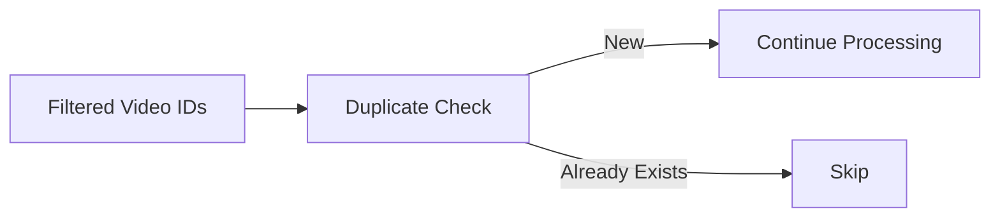
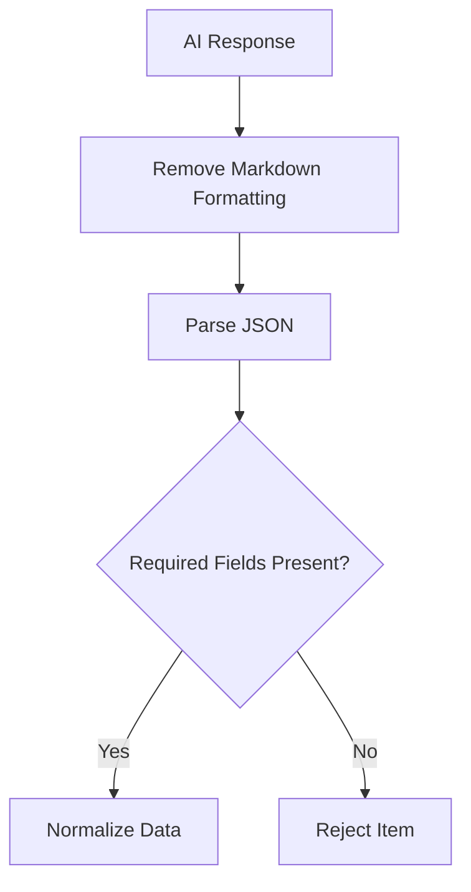
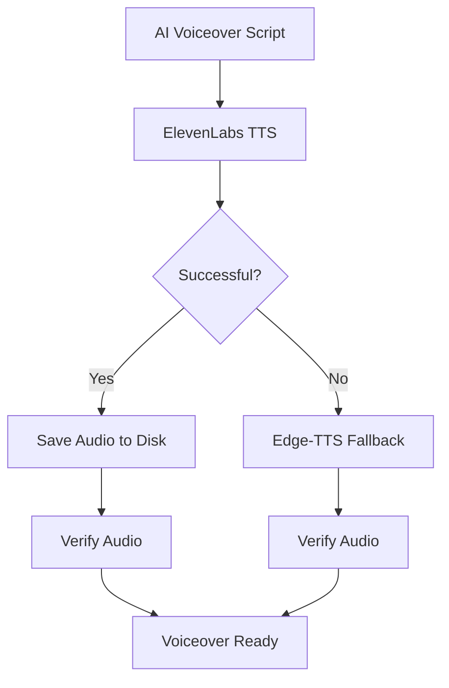
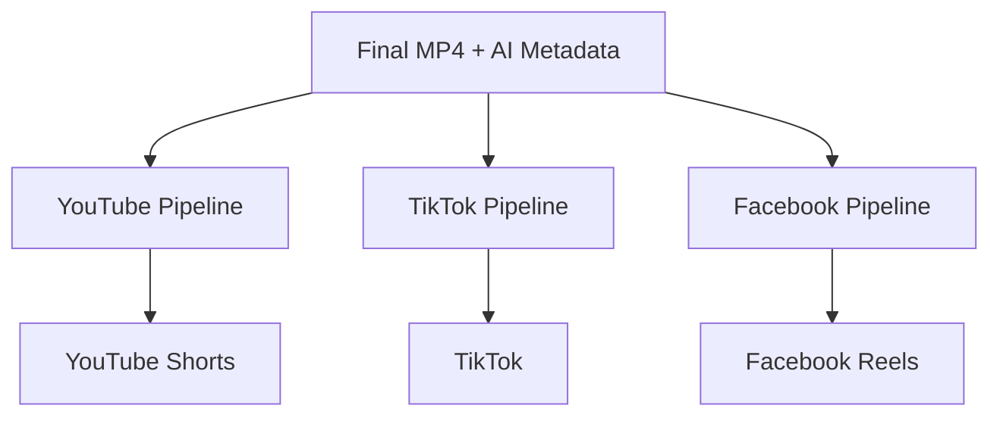
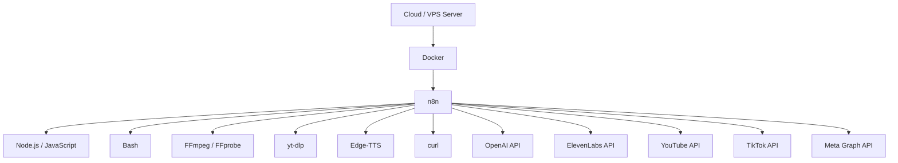

# System Architecture

This document describes the technical architecture of the **AI Football Media Engine**, an end-to-end automation workflow built with n8n for discovering football content, generating AI-assisted metadata and commentary, processing media, and distributing finished short-form videos to multiple social platforms.

The system follows a modular pipeline architecture in which each stage has a specific responsibility and passes structured data to the next stage.

---

## 1. High-Level Architecture



The architecture can be divided into six main layers:

1. **Ingestion Layer**
2. **Filtering & Deduplication Layer**
3. **AI Decision Layer**
4. **Media Acquisition Layer**
5. **Media Processing Layer**
6. **Distribution Layer**

---

# 2. Workflow Orchestration

The entire system is orchestrated using **n8n**.

n8n acts as the central controller responsible for:

* Scheduling workflow executions
* Moving data between components
* Running JavaScript transformation logic
* Executing Bash commands
* Calling AI services
* Handling API authentication
* Managing conditional branches
* Controlling retries
* Handling individual content items
* Coordinating social media publishing

The workflow is designed primarily for a **self-hosted n8n environment** because several stages rely on operating-system-level tools such as:

* FFmpeg
* FFprobe
* yt-dlp
* Edge-TTS
* Bash
* curl

---

# 3. Ingestion Layer

## 3.1 Scheduled Execution

The workflow begins with an n8n Schedule Trigger.

The current configuration executes the discovery pipeline every three hours.

```text
Schedule Trigger
      ↓
Reddit RSS
```

This allows the workflow to periodically scan for new football content without requiring manual execution.

---

## 3.2 Reddit RSS Discovery

The content discovery source is Reddit RSS.

The workflow retrieves daily top posts from:

```text
r/soccer
```

using the Reddit RSS endpoint.

RSS was chosen because it provides a lightweight discovery mechanism without requiring a separate Reddit API authentication flow.

The RSS stage provides metadata such as:

* Post title
* Reddit URL
* Publication date
* Embedded content
* Source references

This metadata becomes the initial input to the filtering engine.

---

# 4. Filtering Layer

The raw RSS feed contains many types of football-related posts that are not necessarily useful for the media pipeline.

A custom JavaScript node performs the first major decision stage.

```text
Reddit RSS
    ↓
JavaScript Filter
```

The filter performs several checks.

---

## 4.1 Negative Keyword Filtering

Posts containing unwanted content categories can be rejected.

Examples include content such as:

* Interviews
* Quotes
* Discussions
* Non-action football posts

This prevents non-video or low-relevance content from entering expensive downstream processing stages.

---

## 4.2 Video Source Validation

The workflow examines post URLs and embedded content to determine whether the post contains a supported video source.

Only supported media sources are allowed to proceed.

This reduces unnecessary download failures later in the pipeline.

---

## 4.3 Football Action Detection

Relevant football events are detected using keyword matching and Regex.

Example target events include:

```text
goal
assist
save
penalty
red card
free kick
```

The workflow can also detect scoreboard-style titles such as:

```text
[1] - 0
2 - [1]
```

This provides an additional way to identify likely goal or match-event posts even when the title does not explicitly contain a target keyword.

---

## 4.4 Content ID Extraction

Each accepted Reddit item is assigned a video identifier derived from the Reddit post URL.

The identifier becomes important throughout the rest of the system because it is used for:

* Duplicate detection
* Temporary filenames
* Voiceover filenames
* Video filenames
* Processing state
* Publishing references

Example:

```text
VIDEO_ID
```

can later produce files such as:

```text
VIDEO_ID_original.mp4
VIDEO_ID_voiceover.mp3
VIDEO_ID_processed.mp4
VIDEO_ID_final.mp4
```

---

# 5. Duplicate Detection Layer

Before AI generation or media downloading occurs, the workflow verifies that the content has not already been processed.



The duplicate system uses a persistent local log:

```text
/home/node/posted_videos.txt
```

Each incoming video ID is compared against this file.

If the ID already exists, the content is skipped.

If the ID is new, it is allowed to continue.

This design prevents:

* Reprocessing the same post
* Duplicate publishing
* Repeated AI API calls
* Repeated media downloads
* Wasted compute resources

The duplicate-checking stage also separates new IDs from the original batch so only valid new items continue downstream.

---

# 6. AI Decision Layer

After filtering and duplicate checking, relevant metadata is sent to an AI strategy agent.

```text
Football Metadata
       ↓
OpenAI Model
       ↓
AI Strategist Agent
       ↓
Structured JSON
```

The AI component is responsible for turning basic football metadata into structured information required by the rest of the automation.

---

## 6.1 AI Strategist

The strategist receives available content metadata such as:

* Post title
* Video information
* Source URL
* Engagement-related metadata

The AI is instructed to produce structured JSON rather than free-form text.

Typical outputs include:

```json
{
  "content_type": "...",
  "optimal_duration": 0,
  "captions": {
    "short": "...",
    "long": "..."
  },
  "voiceover_script": "...",
  "hashtags": [],
  "youtube_seo": {
    "title": "...",
    "description": "...",
    "tags": []
  },
  "editing": {
    "start_offset": 0
  }
}
```

This structured response becomes the central metadata object used by later workflow stages.

---

# 7. AI Output Validation

The workflow does not directly trust the LLM response.

A dedicated JavaScript parser performs strict validation.



Required fields include important values such as:

* Content type
* Recommended duration
* Captions
* Voiceover script
* YouTube SEO information

If the AI returns malformed JSON or omits critical fields, the affected video is rejected.

If every video in the batch fails AI validation, the workflow stops instead of continuing with invalid data.

---

## 7.1 Metadata Normalization

The AI parser also converts the nested AI response into fields that are easier for n8n nodes to consume.

Examples include:

```text
duration
caption_short
caption_long
caption_video_safe
voiceover_script
hashtags
start_offset
```

The original complete strategy object is preserved while commonly used values are also flattened.

---

## 7.2 Caption Sanitization

Before captions reach FFmpeg, unsupported or problematic characters are removed.

For example, emoji characters are stripped from the video-safe caption.

This reduces the chance of FFmpeg text-rendering failures when captions are burned into the final video.

---

# 8. Item Processing

Accepted posts are processed as individual workflow items.

This prevents a single content item from becoming mixed with metadata belonging to another item.

Conceptually:

```text
Batch
 │
 ├── Video A → process
 │
 ├── Video B → process
 │
 └── Video C → process
```

Each item maintains its own:

* Video ID
* AI strategy
* Caption
* Voiceover script
* Downloaded file
* Audio
* Final video

This is particularly important because media processing involves temporary files stored on disk.

---

# 9. Media Acquisition Layer

The media acquisition stage uses **yt-dlp**.

```text
Validated Content
       ↓
     yt-dlp
       ↓
Original Video
```

The download engine determines the appropriate media URL and attempts to retrieve the highest suitable quality.

---

## 9.1 Download Strategy

The downloader distinguishes between Reddit-hosted media and other supported platforms.

For Reddit-hosted videos, the Reddit post URL may be used so yt-dlp can correctly resolve the associated audio and video streams.

For standard supported sources, the original media URL is passed directly to yt-dlp.

---

## 9.2 Download Configuration

The downloader attempts to retrieve high-quality video and audio streams and merge them into MP4 format.

The process includes:

* Video download retries
* Fragment retries
* Network timeout configuration
* Playlist prevention
* MP4 output merging
* File existence verification

The n8n download node also contains workflow-level retry behavior.

---

# 10. Download Validation

After downloading, FFprobe extracts information about the media.

Metadata includes:

```text
duration
file size
resolution
file path
```

The parsed information is merged back into the existing workflow item.

A working directory is assigned:

```text
/tmp/football_ai
```

This directory acts as temporary storage for media-processing assets.

---

# 11. Voiceover Architecture

The workflow contains a multi-path voiceover architecture.



This provides resilience if the primary TTS path fails.

---

## 11.1 ElevenLabs Path

The workflow contains an ElevenLabs text-to-speech node.

The generated audio is written from workflow memory to disk as:

```text
VIDEO_ID_voiceover.mp3
```

The file is then inspected with FFprobe to determine its duration.

---

## 11.2 Edge-TTS Fallback

If the main TTS path fails, the workflow can generate the voiceover using Edge-TTS from the server.

The fallback uses a neural voice configuration and generates the same expected output structure:

```text
VOICEOVER_DURATION
VOICEOVER_SIZE
PATH
```

Because both TTS paths produce compatible output metadata, downstream nodes do not need to know which provider generated the audio.

This is an example of a **fallback interface pattern**.

---

# 12. Audio Preparation

Before final editing, the workflow prepares the required audio assets.

The final editor expects:

```text
Voiceover
+
Background Music
```

The voiceover acts as the primary spoken audio track.

Background music is mixed underneath it at a lower volume.

---

# 13. Video Processing Layer

The most computationally intensive component is the custom FFmpeg and Bash video-processing engine.

```text
Original Video
     +
Voiceover
     +
Background Music
     +
AI Editing Metadata
     ↓
FFmpeg Processing
     ↓
Final Vertical Video
```

The editor runs directly on the n8n host using an Execute Command node.

---

# 14. Video Processing Stages

## 14.1 Input Validation

Before editing starts, the script verifies that both required files exist:

```text
VIDEO_ID_original.mp4
VIDEO_ID_voiceover.mp3
```

If either file is missing, processing stops.

---

## 14.2 Segment Extraction

FFprobe first determines the source video duration.

The script calculates several timestamps across the video and extracts short segments using FFmpeg.

Presentation timestamps are reset using:

```text
setpts=PTS-STARTPTS
```

The segments are concatenated into a new intermediate video.

This ensures that the resulting sequence has a clean timeline after multiple trims.

---

## 14.3 Vertical Formatting

The editor produces content designed for vertical short-form platforms.

The target canvas is:

```text
1080 × 1920
```

The workflow uses a combination of:

* Scaling
* Cropping
* Background filling
* Foreground positioning
* Aspect-ratio preservation

A blurred full-screen background is generated while the main foreground video remains visible within the vertical frame.

---

## 14.4 Caption Rendering

The AI-generated caption is prepared before being passed to FFmpeg.

The Bash script performs:

* Word wrapping
* Character escaping
* Caption positioning
* Font configuration
* Background box rendering
* Text borders

Captions are then rendered directly into the video using FFmpeg's `drawtext` filter.

---

## 14.5 Visual Processing

The FFmpeg filter chain performs several video-enhancement operations.

These include:

* Scaling
* Cropping
* Mirroring
* Rotation
* Frame-rate processing
* Contrast adjustment
* Brightness adjustment
* Saturation adjustment
* Gamma adjustment
* Blur
* Foreground/background composition
* Caption rendering

The result is encoded using H.264.

---

# 15. Audio Mixing

After the visual processing stage, the workflow combines:

```text
AI Voiceover
+
Background Music
```

FFmpeg handles the audio pipeline.

The voiceover remains the primary audio source while background music is mixed underneath.

The pipeline includes:

* Volume control
* Audio padding
* Looping
* Duration trimming
* Audio mixing
* Loudness normalization
* AAC encoding

The completed audio is then mapped onto the processed video.

---

# 16. Final Media Generation

The final media asset is stored as:

```text
/tmp/football_ai/VIDEO_ID_final.mp4
```

After successful generation, the script extracts:

* Final path
* Final file size
* Final duration

Temporary intermediate files are deleted to prevent unnecessary disk accumulation.

Examples include:

```text
VIDEO_ID_trimmed.mp4
VIDEO_ID_processed.mp4
VIDEO_ID_original.mp4
VIDEO_ID_voiceover.mp3
```

The final video remains available for publishing.

---

# 17. Distribution Architecture

Once media processing succeeds, the workflow branches into platform-specific distribution pipelines.



Each branch uses the same central content object but adapts it to the requirements of the target platform.

---

# 18. YouTube Publishing

The YouTube branch uses the n8n YouTube integration.

AI-generated SEO fields are mapped directly into the upload request.

Examples include:

```text
youtube_seo.title
youtube_seo.description
youtube_seo.tags
```

The video is published using authenticated YouTube OAuth credentials.

This demonstrates how AI-generated metadata can move directly from an LLM into a production API integration after validation.

---

# 19. TikTok Publishing

TikTok publishing uses the TikTok publishing API.

The architecture follows a multi-stage upload process.


Before upload, the exact video file size is calculated.

The workflow initializes the TikTok publishing request and receives an upload URL.

The MP4 file is then streamed directly from server storage using `curl`.

The upload includes HTTP headers such as:

```text
Content-Type
Content-Length
Content-Range
```

This avoids loading the entire video into n8n memory for the final upload step.

---

# 20. Facebook Reels Publishing

The Facebook branch uses the Meta Graph API.

The final caption combines AI-generated content such as:

```text
Long Caption
+
Hashtags
```

The Facebook publishing script:

1. Locates the final video
2. Validates file existence
3. Calculates file size
4. Initializes the Reel upload
5. Communicates with the Meta Graph API
6. Transfers the media
7. Finalizes the publishing request

Authentication values are expected to be supplied by the user and are not intended to be stored in the public repository.

---

# 21. Data Flow

A simplified representation of the main data object is:

```json
{
  "video_id": "...",
  "title": "...",
  "video_url": "...",
  "reddit_url": "...",

  "strategy": {
    "content_type": "...",
    "optimal_duration": 0,

    "captions": {
      "short": "...",
      "long": "..."
    },

    "voiceover_script": "...",

    "hashtags": [],

    "youtube_seo": {
      "title": "...",
      "description": "...",
      "tags": []
    }
  },

  "downloaded_path": "...",
  "downloaded_duration": 0,
  "voiceover_path": "...",
  "final_video_path": "..."
}
```

The same object is gradually enriched as it moves through the workflow.

Conceptually:

```text
Reddit Metadata
      ↓
+ Filtering Data
      ↓
+ AI Strategy
      ↓
+ Download Metadata
      ↓
+ Voiceover Metadata
      ↓
+ Final Video Metadata
      ↓
Publishing
```

This reduces the need for separate databases or state-management services for individual workflow executions.

---

# 22. Failure Handling

Several stages contain defensive validation.

## AI Failure

Malformed or incomplete AI responses are rejected before media processing.

## Download Failure

The download stage contains retry logic and verifies that the expected video file exists.

## Voiceover Failure

The workflow includes an alternate TTS path so voice generation can continue if the primary provider fails.

## Media Processing Failure

The FFmpeg script checks for expected input and output files.

If required assets are missing, the processing script exits with an error instead of silently continuing.

---

# 23. Temporary File Architecture

Media processing uses local disk storage rather than keeping large binary media objects entirely inside n8n memory.

Primary working directory:

```text
/tmp/football_ai
```

This approach is useful for video automation because FFmpeg, yt-dlp, FFprobe, Edge-TTS, and curl can interact directly with files on disk.

It also reduces the amount of large binary data being transferred between n8n nodes.

---

# 24. Deployment Architecture

A typical deployment looks like:



The n8n container or host environment therefore needs access to the external command-line dependencies used by the workflow.

---

# 25. External Services

The architecture integrates several external systems.

| Service        | Role                                     |
| -------------- | ---------------------------------------- |
| Reddit RSS     | Football content discovery               |
| OpenAI         | Content strategy and metadata generation |
| ElevenLabs     | Primary text-to-speech generation        |
| Edge-TTS       | Voiceover fallback                       |
| yt-dlp         | Media retrieval                          |
| FFmpeg         | Video and audio processing               |
| FFprobe        | Media inspection                         |
| YouTube API    | YouTube publishing                       |
| TikTok API     | TikTok publishing                        |
| Meta Graph API | Facebook Reels publishing                |

---

# 26. Security Design

The public repository should not contain production secrets.

Sensitive values should be configured separately from the workflow export.

Examples include:

```text
API keys
OAuth access tokens
OAuth client secrets
Facebook access tokens
Platform account identifiers
```

n8n credentials should be configured through the n8n credential system rather than hardcoded into public workflow files.

Repository examples should use placeholders wherever credentials or account-specific configuration would otherwise appear.

---

# 27. Architectural Design Principles

The workflow follows several useful automation design principles.

### Modular Responsibility

Each node or node group performs a clearly defined task.

### Early Filtering

Irrelevant content is rejected before expensive AI or media-processing operations occur.

### Validation Between Boundaries

External systems such as AI models, downloaders, and TTS services are validated before their output is passed downstream.

### Graceful Fallback

Voice generation can switch to an alternative implementation when the primary TTS path fails.

### Disk-Based Media Processing

Large media assets are processed through local files rather than continuously moving binary payloads through workflow memory.

### Structured AI Output

AI responses are treated as machine-readable data rather than unstructured prose.

### Platform Separation

YouTube, TikTok, and Facebook publishing are independent branches, allowing each integration to evolve without redesigning the entire processing pipeline.

---

# 28. Extensibility

The architecture can be expanded without rebuilding the core pipeline.

Potential extensions include:

```text
Additional content sources
       ↓
Twitter/X
YouTube feeds
Sports APIs
News feeds
```

Additional AI stages could provide:

```text
Player recognition
Match classification
Language translation
Content scoring
Advanced metadata generation
```

Additional output platforms could include:

```text
Instagram Reels
X
Telegram
Discord
Cloud storage
CMS platforms
```

Because discovery, AI processing, media generation, and distribution are separated into different layers, new integrations can be attached to the appropriate layer.

---

# 29. Architecture Summary

The complete system follows this pattern:

```text
                    ┌─────────────────┐
                    │ Schedule Trigger │
                    └────────┬────────┘
                             │
                             ▼
                    ┌─────────────────┐
                    │   Reddit RSS    │
                    └────────┬────────┘
                             │
                             ▼
                    ┌─────────────────┐
                    │ Filter + Regex  │
                    └────────┬────────┘
                             │
                             ▼
                    ┌─────────────────┐
                    │ Duplicate Check │
                    └────────┬────────┘
                             │
                             ▼
                    ┌─────────────────┐
                    │ OpenAI Strategy │
                    └────────┬────────┘
                             │
                             ▼
                    ┌─────────────────┐
                    │ JSON Validation │
                    └────────┬────────┘
                             │
                             ▼
                    ┌─────────────────┐
                    │     yt-dlp      │
                    └────────┬────────┘
                             │
                             ▼
                ┌─────────────────────────┐
                │ Voiceover Generation    │
                │ ElevenLabs → Edge-TTS   │
                └────────────┬────────────┘
                             │
                             ▼
                    ┌─────────────────┐
                    │ FFmpeg + Bash   │
                    │ Video Processor │
                    └────────┬────────┘
                             │
                             ▼
                    ┌─────────────────┐
                    │   Final MP4     │
                    └────────┬────────┘
                             │
                 ┌───────────┼───────────┐
                 │           │           │
                 ▼           ▼           ▼
            ┌─────────┐ ┌─────────┐ ┌─────────┐
            │ YouTube │ │ TikTok  │ │Facebook │
            │ Shorts  │ │         │ │ Reels   │
            └─────────┘ └─────────┘ └─────────┘
```

The result is a modular automation system combining:

**workflow orchestration, AI decision-making, media engineering, command-line processing, API integration, validation, fallback handling, and multi-platform distribution.**
